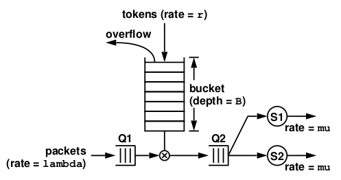
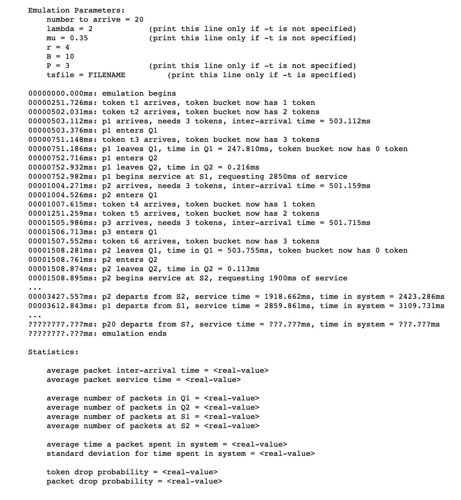

# Multithreading using POSIX Library
Warmup 2 exercise done as a part of CSCI 402 - Operating Systems

The purpose of this exercise is to __emulate/simulate a traffic shaper__ that transmits/services packets controlled by a __Token Bucket Filter__ depicted below using __Multi-threading within a single process__.

I have emulated the packet and token arrivals, the operation of the token bucket filter, the first-come-first-served queues Q1 and Q2, and servers S1 and S2. I also produce a trace of your emulation for every important event occurred in your emulation. Please see the image below for more details.

The emulation used:

* one thread for packet arrival
* one thread for token arrival
* one thread for each server

In addition, I also used one __Mutex__ to protect Q1, Q2, and the token bucket.
